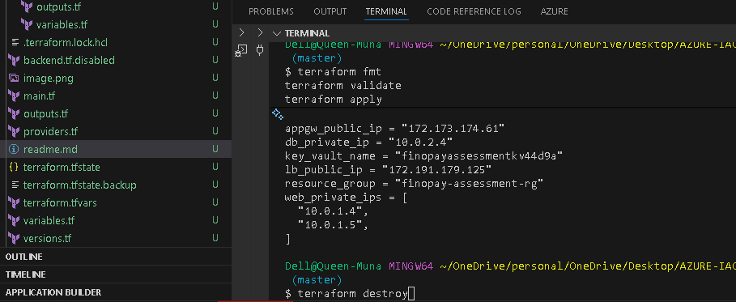
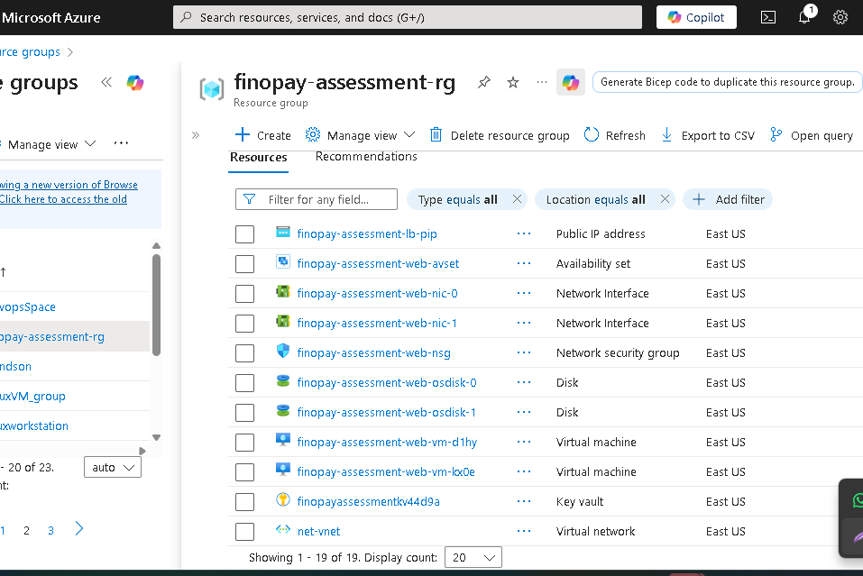

# Project
```
azure-two-tier-infrastructure-deployment/
├── main.tf                   # Root module linking all submodules
├── variables.tf              # Global variables
├── outputs.tf                # Exported values (IPs, DNS, etc.)
├── backend.tf.disabled       # Remote backend (enable for Azure Storage)
├── terraform.tfvars          # Environment-specific values
├── versions.tf               # Provider & Terraform versions
│
├── modules/
│   ├── resource-group/
│   ├── network/
│   ├── nsg/
│   ├── availability-set/
│   ├── vm/
│   ├── load-balancer/
│   ├── app-gateway/
│   ├── key-vault/
│   ├── sql/
│   └── backup/
│
└── README.md                
```

## Prerequisites

| Tool                                                                       | Description                 | Install Command                                                 |
| -------------------------------------------------------------------------- | --------------------------- | --------------------------------------------------------------- |
| [Azure CLI](https://learn.microsoft.com/en-us/cli/azure/install-azure-cli) | Used for authentication     | `winget install Microsoft.AzureCLI` or `brew install azure-cli` |
| [Terraform ≥ 1.6](https://developer.hashicorp.com/terraform/downloads)     | Infrastructure as Code tool | Download from HashiCorp                                         |
| [Git](https://git-scm.com/)                                                | Version control             | `sudo apt install git` or `brew install git`                    |
| [VS Code](https://code.visualstudio.com/)                                  | Optional but recommended    | Download from Microsoft                                         |


## How to Run this

git clone https://github.com/<your-org>/azure-two-tier-iac.git
cd azure-two-tier-iac


## Connect to Azure Cli 
```
az login --tenant <your tenant id>   # login to azure on your vscode terminal
az account list -o table # get your accounts
or
az account show --query id -o tsv   # get your subcription id
az account set --subscription "subid"  # set a sub on terminal
```

#### Build 
```
terraform init -reconfigure
terraform fmt
terraform validate

terraform plan -out=tfplan
terraform apply -auto-approve
```

####  Destroy
```
terraform destroy -auto-approve
```



